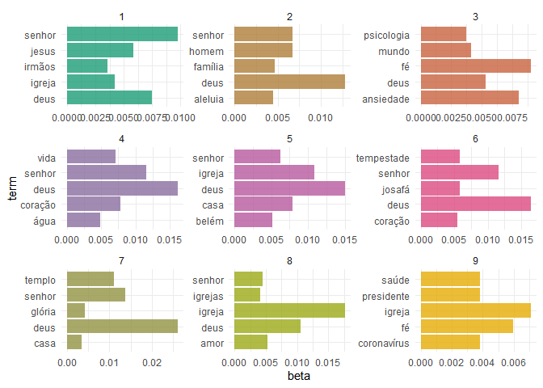
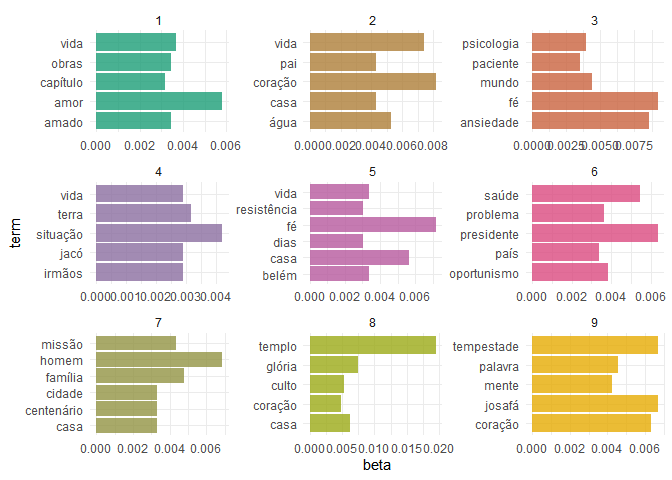

COVID & Religion in Brazil
================
Gustavo Arruda
2020-12-10

## Background

I collected the data set used for this analysis during the Summer of
2020 for the [Preaching Goes
Viral](https://blogs.miamioh.edu/critical-distance/preaching-goes-viral-responses-to-the-pandemic/)
project. PGV focused on archiving online religious responses to the
pandemic; this data set in particular focused on Brazilian
Pentecostal-charismatic churches. Pentecostalism is a strand of
Protestantism originated in California in the 1910s focused on
spontaneous present-day gifts of the Spirit, like speaking in tongues,
exorcisms and prophesying. Today, Pentecostalism is represented by
around a third of the Brazilian population; and by a third of the
Brazilian Congress. The objective of this analysis is to uncover the
thematic structure of this corpus, taken out of official websites and
social media profiles of large denominations. To achieve that, I am
using a Latent Dirichlet allocation algorithm, which creates a
probabilistic topical model.

## Analysis

<!-- -->

A first model shows the need to not only consider broader Portuguese
stop words, but also stop words particular to this field. The following
model takes that into account, eliminating words like “senhor”, “deus”
and “aleluia”.

<!-- -->

After eliminating some relevant stop words, we have a more useful
topical model of this corpus.

  - **Topic 3** was the first to stand out to me. It says
    *“psychology”*, *“patient”*, *“world”*, *“faith”* and
    *“anxiety”*. The topic seems to refer to mental health, with a
    large preponderance of mentions to “faith” and “anxiety”. We cannot
    infer with certainty the mechanics of the association between the
    two words within this topic in the corpus, but we now have reasons
    to believe faith and anxiety were discursively presented in some
    proximity, either by contrast, association or even causation.

  - **Topic 6** also immediately stands out, with *“health”*,
    *“problem”*, *“president”*, *“country”* and *“opportunism”*.
    Topic 6 seems to be largely associated to national politics. It is
    reasonable to sense a sense of dismay in relation to politics, but
    again the discursive mechanics is not graspable with this method.
    For example, “opportunism” and “president” could be used in some
    sort of conflation, in a criticism of Bolsonaro, or of opposition,
    in a criticism of challenges against him and hope for more national
    unity.

  - **Topic 8** shows us *“temple”*, *“glory”*, *“service”*, *“heart”*,
    *“house”*. The underlying relationship among the different words
    seems to be in-person services and social distancing.

  - **Topic 9** mentions the biblical king *Jehosaphat* and *“storm”*,
    which seems to reference the story in which said king won a war
    through deference to God, fasting and prayer. This topic seems to
    point to a particular biblical exegesis emphasizing unity and
    deference to authority. It is uncertain who are the authorities one
    should be deferential towards though: public health specialists,
    Bolsonaro or the pastors?

  - I was not able to make sense of **Topic 1**, **Topic 2**, **Topic
    4**, **Topic 5** and **Topic 7** also uncovered by this model.
